 

This is a personal account that is unrelated to professional work. This account is focused around open-source and occasional personal projects.

Feel free to reach out: nick (at) siloworks.com.

 

 

